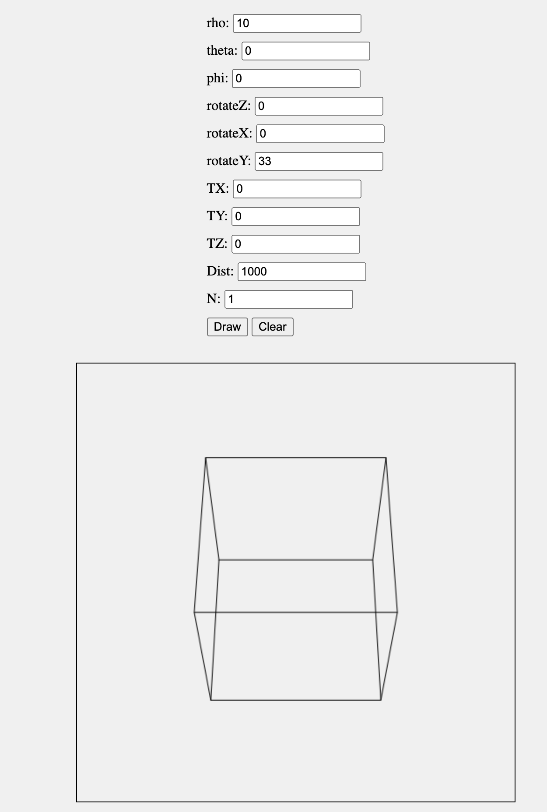

# 3D Perspective Renderer

A TypeScript module for rendering 3D objects with perspective transformations using HTML Canvas.

## Features

- Vector3D class for 3D vector operations
- Perspective class for perspective transformations
- Interactive controls for manipulating 3D objects

## Installation

Clone the repository and install dependencies:

```sh
git clone https://github.com/yourusername/3d-perspective-renderer.git
cd 3d-perspective-renderer
npm install
```

# Example Usage

See https://1907182.playcode.io/



